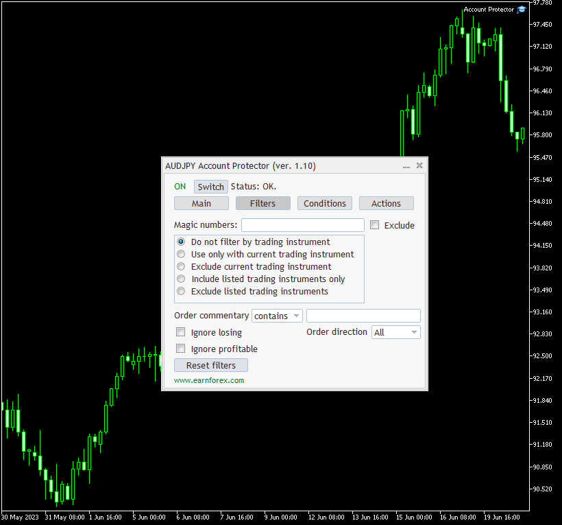

EA Account Protector for MT4 and MT5 by EarnForex.com

The Account Protector Expert Advisor offers a comprehensive solution for automating critical trade management tasks, including emergency position closures, through its user-friendly chart panel interface. This EA provides a wide range of settings to customize your trading experience.

Key features include the ability to set multiple conditions from an extensive list, configure filters for positions and orders, implement trailing stops and break-even trailing, schedule actions using a timer, and utilize an emergency button for swift resolution of unfavorable trading situations.

For a detailed overview of the Account Protector Expert Advisor, please visit:
https://www.earnforex.com/metatrader-expert-advisors/Account-Protector/
